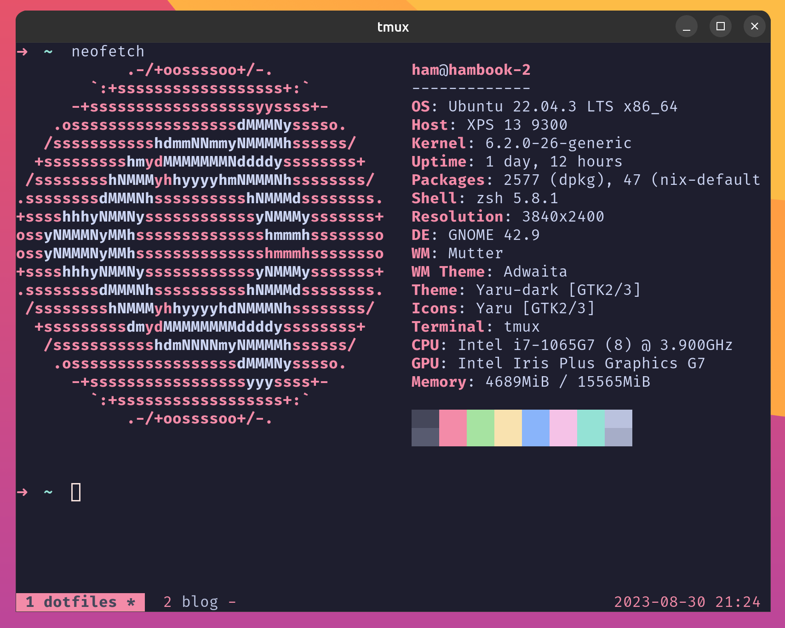

dotfiles
========

A collection of my personal dotfiles.

Here's a little preview of what it looks like with a gorgeous
[**Root Loops theme**](https://rootloops.sh) enabled.

Installation
------------

Your first step is to clone this repository:

    git clone https://github.com/hamvocke/dotfiles.git ~/.dotfiles

### Manual Installation

Create symbolic links for the configurations you want to use, e.g.:

    ln -s ~/.dotfiles/vim/.vimrc ~/.vimrc

### Using [GNU Stow](https://www.gnu.org/software/stow/) _(recommended)_

Install GNU Stow _(if not already installed)_

    Mac:      brew install stow
    Ubuntu:   apt-get install stow
    Fedora:   yum install stow
    Arch:     pacman -S stow

Then simply use stow to install the dotfiles you want to use:

    cd ~/.dotfiles
    stow vim
    stow tmux

Consistent colors
-----------------

To get the most out of my dotfiles I recommend using matching colorschemes for various applications. One way would be to use [base16-shell](https://github.com/chriskempson/base16-shell) on your system, define it in your `.zshrc` and let that handle setting your colors globally. Alternatively, you can pick a well-loved colorscheme and set it up in your terminal emulator (e.g. alacritty), vim, and other tools you'd want to use. 

If you're fancy generating your own snazzy color scheme, go and check out [Root Loops](http://rootloops.sh)

Fonts
-----

I'm relying on Nerd Fonts in some of my configurations. These are special fonts that come with extra glyphs that allow you to display small icons, UI elements and other fancy stuff on the command line. You don't have to use these, but if you don't some things could look a little less good. You can simply [download your Nerd Font of choice over here](https://www.nerdfonts.com).

Additional configuration
------------------------

Some of the configurations need additional setup or configuration. If that's the case you can find a `README.md` file in the application's directory. Make sure to take a look at it to see what else there is to do to make the configuration work on your system.
