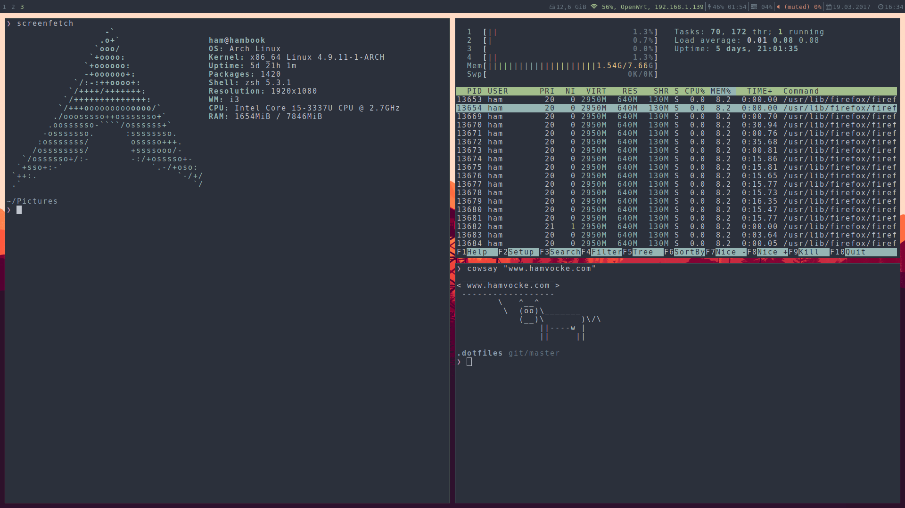

dotfiles
========

A collection of my personal dotfiles. Here's a little preview of what it can look like:

**tmux**

**i3 window manager**

Installation
------------
Your first step is to clone this repository:

    git clone https://github.com/hamvocke/dotfiles.git ~/.dotfiles

### Manual Installation
Create symbolic links for the configurations you want to use, e.g.:

    ln -s ~/.dotfiles/vim/.vimrc ~/.vimrc

### Using [GNU Stow](https://www.gnu.org/software/stow/) _(recommended)_
Install GNU Stow _(if not already installed)_

    Mac:      brew install stow
    Ubuntu:   apt-get install stow
    Fedora:   yum install stow
    Arch:     pacman -S stow

Then simply use stow to install the dotfiles you want to use:

    cd ~/.dotfiles
    stow vim
    stow tmux

Use base16 colors
-----------------
To get the most out of my dotfiles I recommend installing [base16-shell](https://github.com/chriskempson/base16-shell) on your system. This will allow you to have unified colors in all your command line applications. If you see that some colors are off when using my setup, installing base16-shell is most likely the way to fix it.

Vim Config
----------
My vim setup relies on [Vundle](https://github.com/VundleVim/Vundle.vim) for plugin handling. If you want to use my `.vimrc` you should either install Vundle first or get rid of all the plugins declared in my `.vimrc`. If you decide to go with Vundle you need to install all plugins once using `PluginInstall` in vim.
